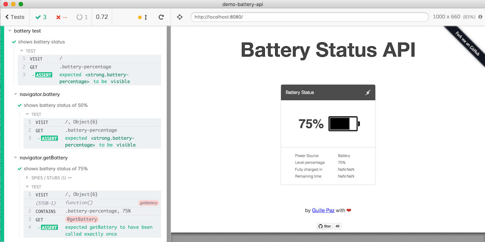

# Cypress tests for Battery Status API [](https://circleci.com/gh/bahmutov/demo-battery-api) [![renovate-app badge][renovate-badge]][renovate-app] [](https://coveralls.io/github/bahmutov/demo-battery-api?branch=bundle)

> Forked from [https://github.com/pazguille/demo-battery-api](https://github.com/pazguille/demo-battery-api) with its demo at [http://pazguille.github.io/demo-battery-api/](http://pazguille.github.io/demo-battery-api/)

## Use

```
git clone git@github.com:bahmutov/demo-battery-api.git
cd demo-battery-api
npm ci
npm run dev
```

Select any spec file from [cypress/integration](cypress/integration) folder



## Specs

All specs are in the [cypress/integration](cypress/integration) folder.

spec | description
--- | ---
[simple.js](cypress/integration/simple.js) | no mocking, actual battery status
[battery.js](cypress/integration/battery.js) | mocks `navigator.battery` method
[get-battery.js](cypress/integration/get-battery.js) | stubs `navigator.getBattery` method
[updates.js](cypress/integration/updates.js) | verifies that application can receive battery status updates
[no-battery.js](cypress/integration/no-battery.js) | shows that application crashes if battery methods are missing

## Read

- [Stub navigator API in end-to-end tests](https://glebbahmutov.com/blog/stub-navigator-api/)
- [Code Coverage for End-to-end Tests](https://glebbahmutov.com/blog/code-coverage-for-e2e-tests/) (see branch [coverage-step](https://github.com/bahmutov/demo-battery-api/tree/coverage-step) for the source code)

[renovate-badge]: https://img.shields.io/badge/renovate-app-blue.svg
[renovate-app]: https://renovateapp.com/
